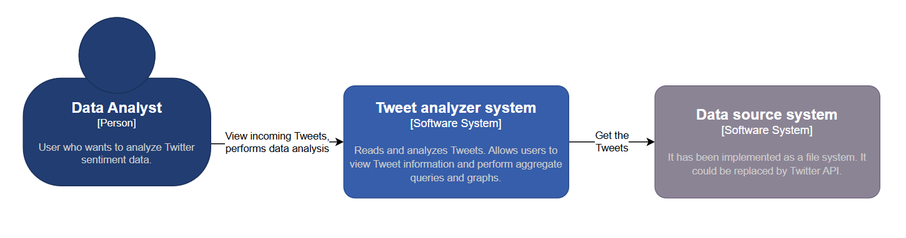
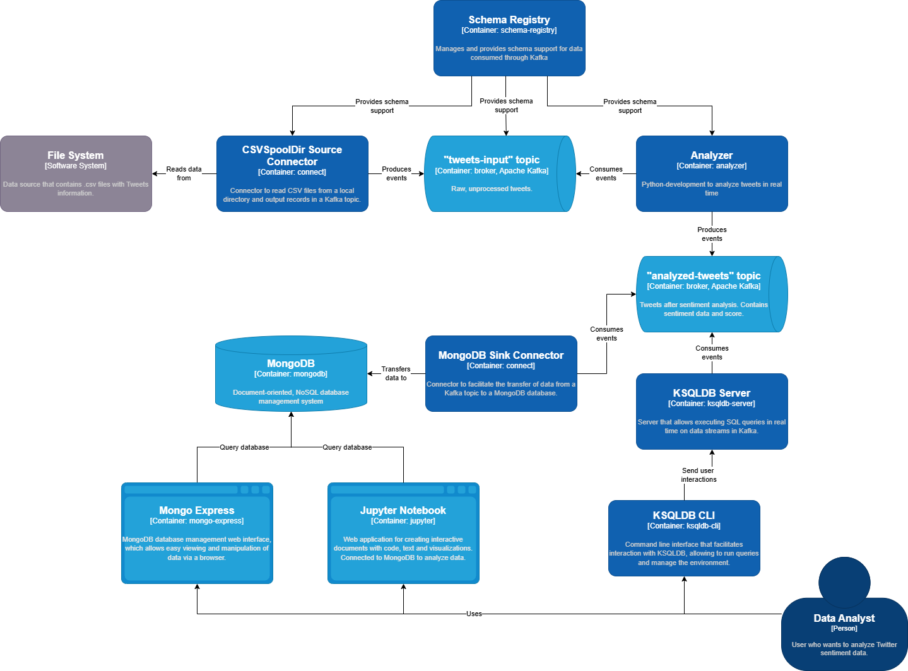

# Diagrama de Arquitectura de Componentes

- [Diagrama de Arquitectura de Componentes](#diagrama-de-arquitectura-de-componentes)
  - [Modelo C4](#modelo-c4)
  - [Descripción de componentes](#descripción-de-componentes)
  - [Justificación de la elección de tecnología](#justificación-de-la-elección-de-tecnología)
    - [Captura de datos mediante CSV Spool Dir Source Connector](#captura-de-datos-mediante-csv-spool-dir-source-connector)
    - [Topic 'tweets-input'](#topic-tweets-input)
    - [Analyzer: Programa en Python en contenedor de Docker](#analyzer-programa-en-python-en-contenedor-de-docker)
    - [Topic 'analyzed-tweets'](#topic-analyzed-tweets)
    - [Análisis de datos y almacenamiento](#análisis-de-datos-y-almacenamiento)
      - [KSQLDB Server y Cli](#ksqldb-server-y-cli)
      - [MongoDB y Jupyter Notebook](#mongodb-y-jupyter-notebook)

---

## Modelo C4
La arquitectura del sistema se representa mediante el [diagrama C4](https://c4model.com/).

**Nivel 1**: Diagrama de contexto del sistema:

**Nivel 2**: Diagrama de contenedores:

**Nivel 3**: Diagrama de componentes.
- El nivel 3 detalla los componentes internos de cada contenedor, mostrando cómo están estructurados y cómo interactúan entre sí para realizar las funciones del sistema.
- En este caso se omite el nivel 3, dado que no se considera necesario.

**Nivel 4**: Diagrama de código
- El nivel 4e adentra en los detalles de implementación a nivel de código fuente, proporcionando una vista detallada de los módulos, clases y relaciones dentro del sistema.
- En este caso se omite este diagrama por simplicidad.

## Descripción de componentes

Se ha empleado una arquitectura basada en Kafka y otros servicios del ecosistema de Big Data para gestionar la captura, análisis y almacenamiento de datos.

1. **Captura de Datos:**
Se utiliza un File System como fuente de datos, donde se almacenan archivos CSV con información de los Tweets. Estos datos se procesan mediante el CSV Spool Dir Source Connector, que los lee y los publica en el topic de Kafka "tweets-input".

2. **Schema Registry - Gestión de Esquemas:**
Para garantizar la consistencia en la lectura de los tweets desde archivo, se emplea el Schema Registry, que gestiona el esquema de los datos. Utiliza Avro para definir y validar los esquemas de los datos que se producen y consumen en un sistema, lo que garantiza la compatibilidad entre diferentes aplicaciones y versiones de esquemas.

3. **Analyzer - Análisis de Sentimientos:**
Los tweets son analizados en tiempo real utilizando el *Analyzer* de tweets, un contenedor de Docker que implementa el analizador de sentimientos de Hugging Face en Python utilizando la librería `transformers` y `torch`. Los resultados se publican en el topic "analyzed-tweets" de Kafka utilizando la librería `kafka-python`.

4. **KSQLDB server y KSQLDB Cli - Procesamiento en Tiempo Real:**
KSQLDB server y KSQLDB Cli posibilitan la ejecución de consultas SQL en tiempo real sobre los streams de Kafka, permitiendo análisis adicional sobre los datos en movimiento.

5. **Almacenamiento en MongoDB:**
Los tweets procesados se transfieren desde el topic "analyzed-tweets" de Kafka a MongoDB mediante el MongoDB Sink Connector. En MongoDB, los datos se almacenan de forma orientada a documentos.

6. **Mongo Express - Interfaz de Usuario Web para Visualización:**
Para visualizar y manipular los datos almacenados en MongoDB, se utiliza Mongo Express, una interfaz de usuario web que permite acceder y gestionar los datos de forma intuitiva.

7. **Jupyter Notebook - Análisis Avanzado:**
Jupyter Notebook se emplea como una herramienta para conectar a MongoDB y realizar análisis avanzados de los datos. Utilizando las librerías `pymongo`, `pandas` y `matplotlib`, se pueden realizar exploraciones detalladas y generar visualizaciones interactivas.

Además de los componentes mencionados, el cluster también incluye **Zookeeper** y **Confluent Enterprise Control Center** para gestionar y monitorear el entorno de Kafka y otros servicios del ecosistema. Zookeeper es esencial para la coordinación y sincronización de los nodos en un clúster de Kafka, mientras que Control Center proporciona una interfaz gráfica para administrar y supervisar todos los aspectos del entorno Kafka, tales como los clusters, brokers, topics, etc.

Para asegurar la conectividad y la comunicación entre los diferentes componentes del sistema, se ha creado una **red Docker** denominada "dh-kafka-network" mediante el archivo de configuración `docker-compose`, lo que permite que todos los servicios interactúen de manera eficiente y segura. Esta red facilita la comunicación entre los contenedores de Docker que alojan los diferentes componentes del sistema, garantizando un funcionamiento sin problemas y una integración efectiva entre ellos.

## Justificación de la elección de tecnología

En esta sección procederemos a explicar por qué se ha seleccionado la tecnología utilizada.

### Captura de datos mediante CSV Spool Dir Source Connector
La decisión de emplear el CSV Spool Dir Source Connector de Kafka Connect para la captura de datos, se basa en la necesidad de simular el flujo de datos a través de la API de Twitter, conforme a la visión inicial del proyecto. 

A pesar de la alternativa de ingestar archivos directamente sin pasar por un topic de Kafka, he elegido esta arquitectura para mantener coherencia con el propósito original de recrear un flujo de datos similar al proporcionado por la API de Twitter. El uso de Kafka Connect permite validar y ajustar los componentes de la arquitectura en un entorno controlado y realista, asegurando su preparación para manejar flujos de datos de APIs externas como Twitter en un escenario de producción. Para conectarnos a una API, sería tan sencillo como sustituir este conector por un REST Source Connector.

Además, el uso de Kafka Connect facilita la integración y escalabilidad del sistema, posibilitando una gestión centralizada de la captura de datos y una mayor flexibilidad para adaptarse a posibles cambios en los requerimientos o fuentes de datos futuras.

### Topic 'tweets-input'
La decisión de crear el topic "tweets-input" se fundamenta en su papel crucial como un buffer de entrada de tweets dentro de la arquitectura, permitiendo que el analyzer extraiga y procese los tweets a su propio ritmo. Esta estrategia evita posibles cuellos de botella al garantizar que el analyzer pueda operar de manera eficiente sin depender directamente de la velocidad de llegada de los tweets. 

Además, esta arquitectura ofrece posibilidades para habilitar un procesamiento paralelo del analyzer en otro escenario. Por ejemplo, podríamos escalar horizontalmente el analyzer, ejecutando múltiples instancias en paralelo, y configurar cada instancia para consumir datos del mismo topic "tweets-input". Esto permitiría distribuir la carga de trabajo y aumentar la capacidad de procesamiento del sistema para manejar grandes volúmenes de tweets de manera simultánea, lo que garantizaría un análisis rápido y eficiente incluso en momentos de alto tráfico de datos.

### Analyzer: Programa en Python en contenedor de Docker
El uso de Python en el Analyzer se justifica por la necesidad de emplear la librería `transformers`, la cual está diseñada específicamente para este lenguaje de programación. Python ofrece una combinación ideal de facilidad de uso y potencia computacional para este propósito. 

Además, la containerización del Analyzer proporciona ventajas significativas en términos de portabilidad, escalabilidad y gestión del entorno de ejecución. Al encapsular el Analyzer en un contenedor Docker, se garantiza la independencia y se facilita su despliegue en diferentes entornos de ejecución sin necesidad de configuraciones adicionales. Además, la containerización facilita la integración con otros componentes del sistema y la habilitación de conexiones internas con el broker de Kafka desde el puerto 19092 mejora la seguridad dentro de la arquitectura.

### Topic 'analyzed-tweets'
El uso del topic "analyzed-tweets" es fundamental dentro de la arquitectura para facilitar la comunicación eficiente y la integración entre los diferentes componentes del sistema. Al publicar los resultados del análisis de sentimientos en este topic, se establece un punto centralizado de acceso a los datos procesados, lo que permite a otros componentes del sistema consumir y realizar análisis adicionales sobre estos datos de manera sencilla y eficiente. Además, al separar el resultado de la etapa de análisis de sentimientos en un topic dedicado, se crea un desacoplamiento entre el proceso de análisis y otros componentes que consumirán esta información a su propio ritmo.

### Análisis de datos y almacenamiento

En este apartado, se han identificado dos casos de uso:

1. **Análisis de datos en tiempo real:** Orientado a los moderadores de la plataforma Twitter, permitiéndoles observar el estado de ánimo del flujo de tweets en tiempo real y tomar acciones inmediatas.
2. **Almacenamiento de datos analizados y análisis avanzado:** Diseñado para los analistas de datos de la plataforma Twitter, facilitando la investigación de dinámicas complejas y la extracción de conclusiones avanzadas, así como la creación de modelos de IA o sistemas basados en reglas.

#### KSQLDB Server y Cli
KSQLDB, una base de datos en memoria orientada a consultas SQL sobre los streams de datos en Kafka, es ideal para realizar análisis en tiempo real. Permite consultas de agregación, filtrado y transformación de datos sobre los flujos en movimiento. Se ha elegido KSQLDB para proporcionar al usuario la capacidad de realizar análisis en tiempo real, con la posibilidad de implementar en un futuro una interfaz de usuario que mantenga los datos actualizados, como una página web.

Además, KSQLDB es una herramienta nativa de Kafka, lo que aporta ventajas en términos de integración y rendimiento.

#### MongoDB y Jupyter Notebook
MongoDB se ha seleccionado para satisfacer las necesidades de almacenamiento a largo plazo, mientras que Jupyter Notebook ofrece un entorno robusto para el análisis de datos.

MongoDB destaca por su capacidad de almacenamiento orientado a documentos y su flexibilidad para manejar datos de manera eficiente. Esto lo hace adecuado para almacenar los datos procesados de manera persistente y permitir análisis complejos y exploratorios mediante herramientas como Jupyter Notebook. Las capacidades avanzadas de consulta y manipulación de datos se potencian con el uso de librerías como `pymongo`, `pandas` y `matplotlib`. La elección de MongoDB junto con Jupyter se fundamenta en la flexibilidad que ofrece MongoDB para la integración con esta herramienta de análisis.

Además, otro punto a favor de MongoDB es la existencia del Mongo Sink Connector, que permite realizar la conexión al topic de Kafka de manera efectiva, asegurando su adecuación para un escenario de producción. Además, el uso de Kafka Connect aporta una gestión centralizada de la salida de datos.