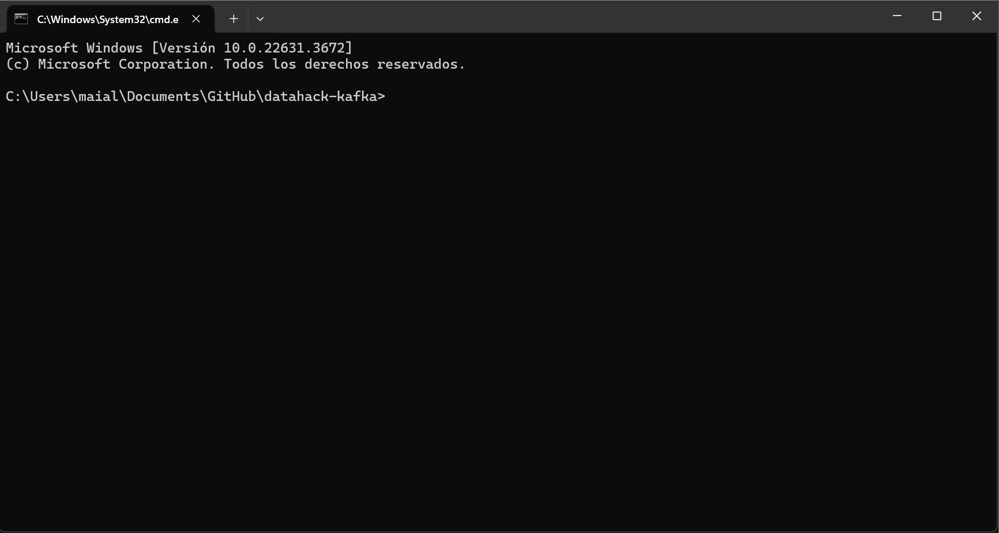
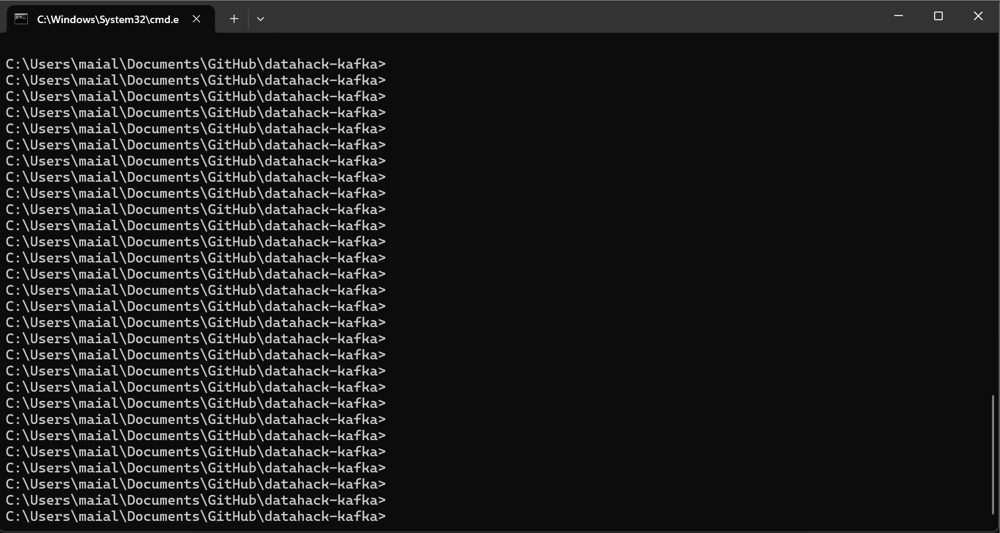
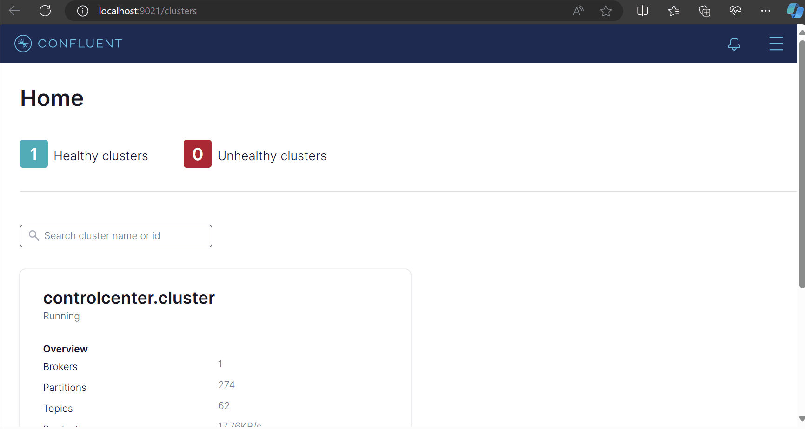
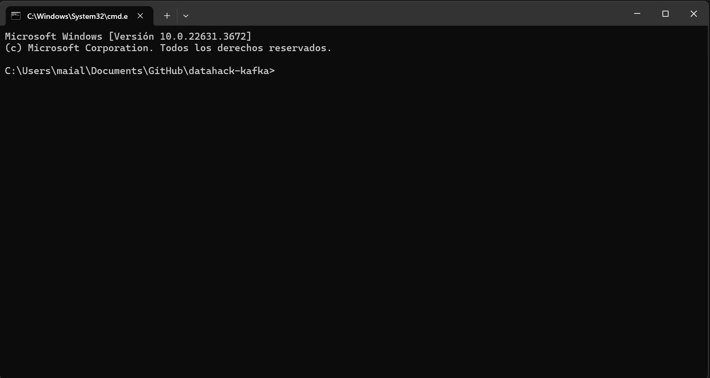

# Manual de Operación

- [Manual de Operación](#manual-de-operación)
  - [Objetivo](#objetivo)
  - [Prerrequisitos para el Despliegue](#prerrequisitos-para-el-despliegue)
  - [Instrucciones de Despliegue del Sistema](#instrucciones-de-despliegue-del-sistema)
  - [Configuración y Detalle Técnico del sistema](#configuración-y-detalle-técnico-del-sistema)
  - [Otras Operaciones](#otras-operaciones)
    - [Consumir Mensajes desde Topics](#consumir-mensajes-desde-topics)
    - [Ver documentos en MongoDB](#ver-documentos-en-mongodb)

---

## Objetivo
El objetivo de este manual es proporcionar instrucciones para desplegar y operar el sistema de análisis y almacenamiento de tweets. Las instrucciones están destinadas a desarrolladores y administradores de sistemas.

## Prerrequisitos para el Despliegue
Los prerrequisitos para desplegar esta solución son los siguientes:

1. **Docker**: Asegúrese de tener Docker instalado en su sistema. Puede descargarlo e instalarlo desde [Docker](https://www.docker.com/products/docker-desktop).

2. **Docker Compose**: Docker Compose también debe estar instalado. Docker Compose generalmente se incluye con Docker Desktop, pero puede verificar su instalación ejecutando `docker-compose --version` en la terminal.

3. **Recursos del Sistema**: El sistema debe tener al menos 8 GB de RAM y espacio de almacenamiento suficiente para los datos generados.

4. **Acceso a Internet**: Durante la construcción y despliegue de los contenedores, es posible que necesite descargar imágenes de Docker y dependencias de Internet.

5. **Permisos de Usuario**: Asegúrese de tener los permisos necesarios para ejecutar Docker y Docker Compose. Esto generalmente significa que debe tener acceso de administrador o ser parte del grupo de usuarios de Docker.

6. **Configuración de Red**: Verifique que no haya conflictos de puertos en su sistema. Los puertos definidos en el archivo `docker-compose.yml` deben estar disponibles y no ser utilizados por otros servicios.


## Instrucciones de Despliegue del Sistema

**Clonar el Repositorio**: Clone el repositorio que contiene el proyecto en su máquina local. Puede hacer esto utilizando Git:

   ```bash
   git clone https://github.com/Ubikitina/datahack-kafka.git
   cd datahack-kafka
   ```

Para **desplegar el sistema**, siga estos pasos:

1. Navegue al directorio raíz del proyecto, donde se encuentra el archivo `docker-compose.yml`.

2. Desde la consola, ejecute el siguiente comando:
   ```bash
   docker-compose up -d
   ```



Este comando despliega todos los servicios necesarios e introduce el archivo de entrada [twitter-extract-01.csv](../connectors/plaintext/dataset/twitter-extract-01.csv). A partir de este archivo, el pipeline se ejecuta automáticamente: los tweets se transfieren del archivo a un topic de Kafka, luego un analizador de sentimiento procesa los tweets y vuelca los resultados a un segundo topic de Kafka. Finalmente, los sistemas de análisis de datos se conectan a este segundo topic para extraer y procesar los datos. Además, se carga el cuaderno [MongoDB.ipynb](../jupyter/MongoDB.ipynb) en Jupyter como un ejemplo o punto de partida para el análisis de datos.


## Configuración y Detalle Técnico del sistema

1. **Conexión del sistema de archivos con un topic de Kafka utilizando un CSV Spool Dir Source Connector:**
   - **Instalación del conector:** Los comandos necesarios para instalar el conector están incluidas en el [Dockerfile](../connectors/Dockerfile) y en el [start.sh](../connectors/start.sh).
   - **Configuración del Source Connector:**  La configuración específica del source connector está disponible en [connect-file-source.json](../connectors/plaintext/connect-file-source.json).

2. **Creación del contenedor con el analizador de sentimientos:**
   - Los archivos necesarios para la creación del contenedor están en el directorio [analyzer](../analyzer/):
     - [app.py](../analyzer/app.py): Código Python que se conecta al topic `tweets-input` de Kafka, analiza los tweets, los enriquece con el sentimiento y los transfiere al topic `analyzed-tweets`.
     - [Dockerfile](../analyzer/Dockerfile): Archivo para crear el contenedor del analizador.
     - [requirements.txt](../analyzer/requirements.txt): Lista de dependencias de librerías Python a instalar.

3. **Conexión con KSQLDB Server y KSQLDB CLI:**
   - Ambos contenedores están definidos y configurados en el archivo [docker-compose.yml](../docker-compose.yml).

4. **Conexión de MongoDB al topic `analyzed-tweets` mediante un Sink Connector:**
   - **Instalación del conector:** Los comandos necesarios para instalar el conector están incluidas en el [Dockerfile](../connectors/Dockerfile) y en el [start.sh](../connectors/start.sh).
   - **Iniciar la replicaset de MongoDB:** La configuración necesaria para iniciar la replicaset está incluida en el [docker-compose.yml](../docker-compose.yml). Nota: Para entornos productivos, se recomienda distribuir la carga en diferentes contenedores.
   - **Configuración del Sink Connector:** La configuración específica del sink connector está disponible en [connect-mongo-sink.json](../connectors/mongo/connect-mongo-sink.json).

5. **Mongo Express:**
   - Mongo Express está configurado en el archivo [docker-compose.yml](../docker-compose.yml).

6. **Jupyter Notebook:**
   - La configuración de Jupyter Notebook también está incluida en el archivo [docker-compose.yml](../docker-compose.yml).
   - La carpeta [jupyter](../jupyter/) contiene todos los archivos necesarios para crear la imagen del contenedor, incluyendo el notebook de ejemplo [MongoDB.ipynb](../jupyter/MongoDB.ipynb), que se carga en la imagen.

Adicionalmente, los detalles de configuración del Zookeeper, Broker, Schema Registry, Control Center pueden encontrarse en el archivo [docker-compose.yml](../docker-compose.yml).


## Otras Operaciones

En esta sección se describen las operaciones adicionales que se pueden realizar durante la administración del sistema. Dichas operaciones pueden ser útiles en la detección de errores y diagnóstico.


### Consumir Mensajes desde Topics
**Opción 1**: Desde la Consola del Broker

Puede consumir mensajes directamente desde los topics utilizando la consola del broker. Siga estos pasos:

1. Abra una terminal y acceda al contenedor del broker:
   ```bash
   docker exec -it broker /bin/bash
   ```

2. Para consumir mensajes desde el inicio:
   ```bash
   # Del topic tweets-input
   kafka-console-consumer --bootstrap-server broker:9092 --topic tweets-input --from-beginning

   # Del topic analyzed-tweets
   kafka-console-consumer --bootstrap-server broker:9092 --topic analyzed-tweets --from-beginning
   ```



**Opción 2**: Desde la Web de Control Center, accediendo a [Control Center](http://localhost:9021/clusters).




### Ver documentos en MongoDB
Para ver los documentos almacenados en MongoDB, siga estos pasos:

1. Abra una terminal y acceda al contenedor de MongoDB:
   ```bash
   docker exec -it mongo bash
   ```

2. Inicie la shell de MongoDB:
   ```bash
   mongosh
   ```

3. Seleccione la base de datos `twitter_data`:
   ```bash
   use twitter_data
   ```

4. Muestre las colecciones disponibles:
   ```bash
   show collections
   ```

5. Visualice los documentos en la colección `sentiment_tweets` en un formato legible:
   ```bash
   db.sentiment_tweets.find().pretty()
   ```

