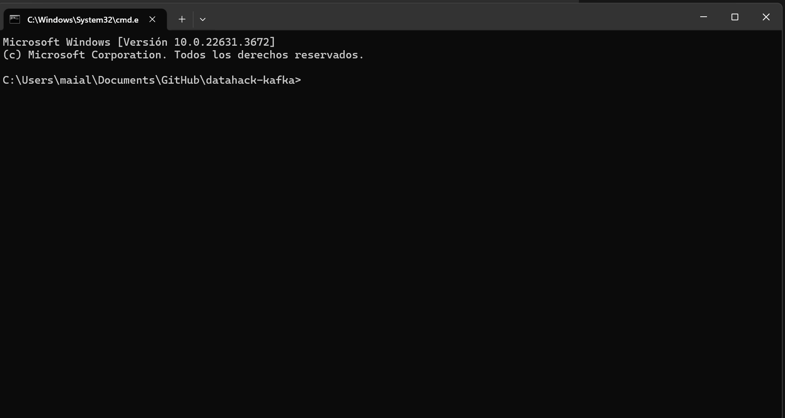
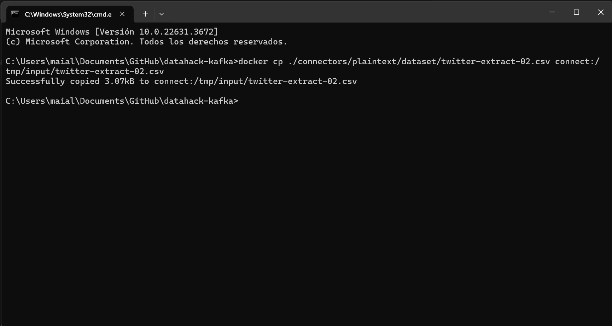
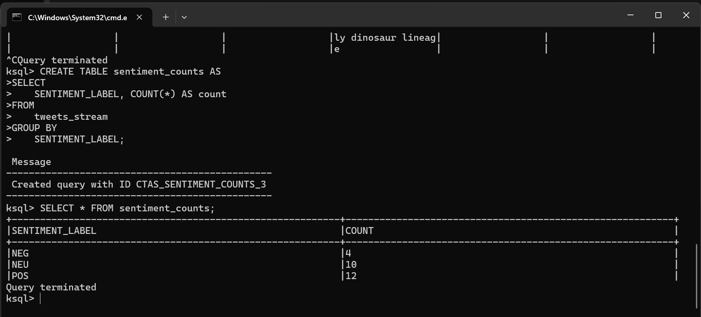
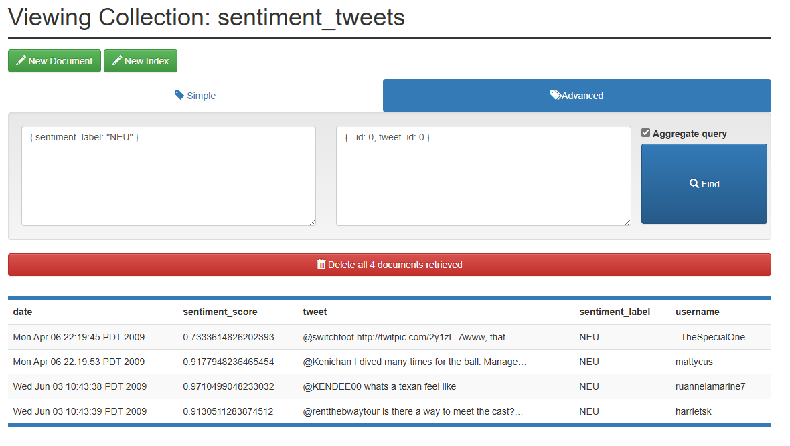
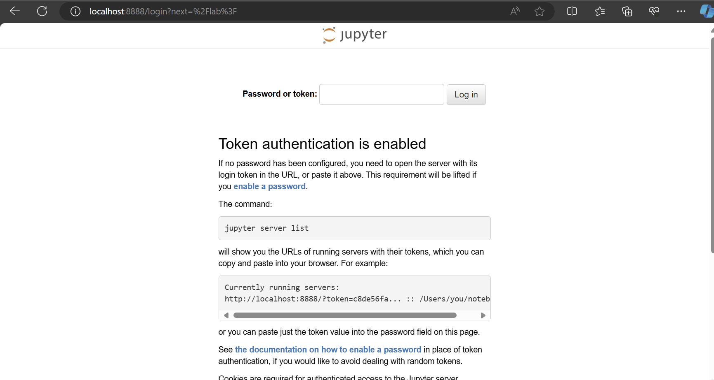

# Manual de Uso

- [Manual de Uso](#manual-de-uso)
  - [Objetivo](#objetivo)
  - [Carga de datos](#carga-de-datos)
  - [Consultas agregadas con KSQLDB en Tiempo Real](#consultas-agregadas-con-ksqldb-en-tiempo-real)
  - [Consultas con Mongo Express](#consultas-con-mongo-express)
  - [Análisis de datos en Jupyter Notebook](#análisis-de-datos-en-jupyter-notebook)

---

## Objetivo
El objetivo de este manual es explicar cómo usar el sistema de análisis y almacenamiento de tweets.

Estas instrucciones están dirigidas a los usuarios finales del sistema y asumen que el sistema ya está desplegado según las [Instrucciones de Despliegue del Sistema](./Manual%20de%20Operacion.md#instrucciones-de-despliegue-del-sistema). Este documento cubre cómo cargar datos y analizar los resultados utilizando consultas agregadas a través de las diferentes interfaces disponibles (KSQLDB, Mongo Express y Jupyter).


## Carga de datos
Para cargar datos, usa archivos CSV con el siguiente **formato**: cuatro campos separados por comas: "tweet_id", "date", "username", "tweet". Puedes encontrar ejemplos de estos archivos en la carpeta [dataset](../connectors/plaintext/dataset/).

El sistema carga los archivos automáticamente desde el directorio `connect:/tmp/input/` del contenedor `connect`, utilizando el conector Kafka CSV Spool Dir. Este conector busca archivos que sigan el **patrón de nombre** `^twitter-extract-.*\\.csv`, es decir, deben comenzar con "twitter-extract-" y terminar con ".csv".

Adicionalmente, durante el despliegue del sistema ya se copía un archivo de ejemplo, [twitter-extract-01.csv](../connectors/plaintext/dataset/twitter-extract-01.csv), en el directorio. Por lo tanto, el sistema comienza cargando estos datos a Kafka (topic `tweets-input`) y espera más archivos para cargar.

Para agregar más archivos y cargar más datos, sigue estos pasos:

1. Sitúa tu consola en el directorio raíz del archivo.
2. Ejecuta los siguientes comandos para copiar los archivos dentro del contenedor:

```bash
# Copiar archivo twitter-extract-02.csv
docker cp ./connectors/plaintext/dataset/twitter-extract-02.csv connect:/tmp/input/twitter-extract-02.csv

# Copiar archivo twitter-extract-03.csv
docker cp ./connectors/plaintext/dataset/twitter-extract-03.csv connect:/tmp/input/twitter-extract-03.csv

# Copiar archivo twitter-extract-04.csv
docker cp ./connectors/plaintext/dataset/twitter-extract-04.csv connect:/tmp/input/twitter-extract-04.csv

# Copiar archivo twitter-extract-05.csv
docker cp ./connectors/plaintext/dataset/twitter-extract-05.csv connect:/tmp/input/twitter-extract-05.csv
```




## Consultas agregadas con KSQLDB en Tiempo Real

El objetivo es hacer consultas agregadas sobre el topic de Kafka `analyzed-tweets` usando KSQLDB.

Para comenzar, necesitas ejecutar el siguiente comando en tu terminal para acceder a la interfaz de línea de comandos de KSQLDB:

```bash
docker exec -it ksqldb-cli ksql http://ksqldb-server:8088
```

Creamos un flujo de datos (*stream*):
```sql
CREATE STREAM tweets_stream (
    tweet_id BIGINT,
    date VARCHAR,
    username VARCHAR,
    tweet VARCHAR,
    sentiment_label VARCHAR,
    sentiment_score DOUBLE
) WITH (
    KAFKA_TOPIC='analyzed-tweets',
    VALUE_FORMAT='JSON'
);
```

Este comando establece un flujo de datos llamado `tweets_stream` que obtiene datos del topic Kafka `analyzed-tweets`. Esto permite que KSQLDB pueda trabajar con estos datos en tiempo real.

A continuación, consultamos este flujo de datos:
```sql
SELECT * FROM tweets_stream EMIT CHANGES;
```

Este comando muestra los datos en tiempo real que fluyen a través del flujo `tweets_stream`. Si añadimos nuevos datos al topic Kafka `analyzed-tweets` (siguiendo las instrucciones explicadas en la sección de arriba de "Carga de datos"), veremos cómo se reflejan automáticamente en esta consulta. Ejemplo:




Ahora, pasamos a una consulta más avanzada. Primero, creamos una vista materializada para contar los sentimientos (es decir, agregamos los resultados por etiqueta de sentimiento):

```sql
CREATE TABLE sentiment_counts AS
SELECT 
    SENTIMENT_LABEL, COUNT(*) AS count
FROM 
    tweets_stream
GROUP BY 
    SENTIMENT_LABEL;
```

Finalmente, ejecutamos esta consulta para obtener los resultados:
```sql
SELECT * FROM sentiment_counts;
```




## Consultas con Mongo Express

Mongo Express es una interfaz web que te permite interactuar con bases de datos MongoDB de forma sencilla y visual. Para comenzar, accede a Mongo Express a través de la URL http://localhost:3000/.

Al ingresar, se te solicitará un nombre de usuario y contraseña. Utiliza las siguientes credenciales:
- **Usuario:** admin
- **Contraseña:** pass

Una vez dentro, encontrarás que los tweets analizados se almacenan en la base de datos `twitter_data`, en la colección `sentiment_tweets`.


Al hacer clic en la colección `sentiment_tweets`, Mongo Express te permite visualizar, editar, eliminar y realizar consultas sobre los datos. Por ejemplo, puedes realizar una consulta avanzada utilizando un filtro y una proyección. Veamos un ejemplo:

- **Query**: `{sentiment_label: "NEU" }`
  - Esta consulta filtra los tweets con sentimiento neutro ("NEU").
- **Projection**: `{_id: 0, tweet_id: 0 }`
  - La proyección especifica qué columnas no se deben mostrar, en este caso, excluyendo `_id` y `tweet_id`.




Además de las funcionalidades mencionadas, Mongo Express también permite crear índices, exportar e importar datos y gestionar usuarios y roles de la base de datos MongoDB.


## Análisis de datos en Jupyter Notebook

Jupyter Notebook es una herramienta poderosa para que los analistas de datos realicen un análisis avanzado de los datos almacenados en MongoDB utilizando librerías específicas de Python. Está diseñada para que los analistas de datos de Twitter puedan investigar las dinámicas de sentimientos en el histórico de los datos.

Para acceder a Jupyter Notebook, abre tu navegador y ve a http://localhost:8888/. Se te solicitará un token de autenticación. Para obtener este token, sigue estos pasos:

1. Abre una terminal y ejecuta el siguiente comando para entrar en el contenedor de Jupyter:

    ```bash
    docker exec -it jupyter bash
    ```

2. Dentro del contenedor, ejecuta este comando para listar los servidores de Jupyter en ejecución:

    ```bash
    jupyter server list
    ```

3. Verás un resultado similar a este:

    ```
    (base) jovyan@08c3c8660b64:~$ jupyter server list
    Currently running servers:
    http://08c3c8660b64:8888/?token=899207b901513ad7168a71b45b73a0bc73e8d8629bb0043d :: /home/jovyan
    ```

4. Copia el token de la URL y pégalo en la página web de Jupyter Notebook.




Una vez dentro de Jupyter Notebook, verás que hay un cuaderno precargado llamado [MongoDB.ipynb](../jupyter/MongoDB.ipynb). Este cuaderno contiene ejemplos y consultas ya programadas para interactuar con los datos en MongoDB.

Para explorar y ejecutar las consultas:

1. Abre el cuaderno `MongoDB.ipynb`.
2. Sigue las instrucciones y ejecuta las celdas de código. Cada celda se puede ejecutar seleccionándola y presionando `Shift + Enter`.


Jupyter Notebook proporciona un entorno interactivo y flexible para trabajar con tus datos, facilitando la experimentación y el descubrimiento de insights valiosos.
